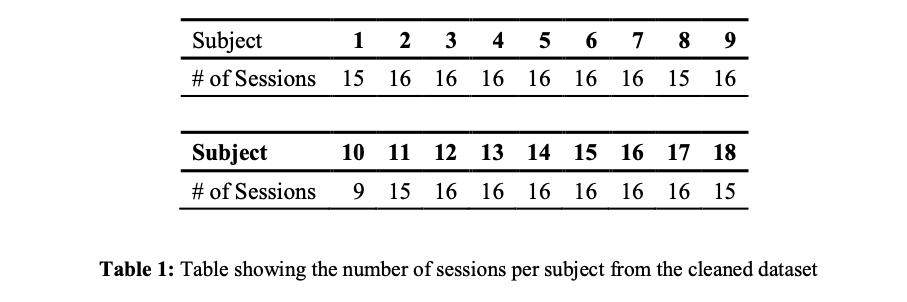
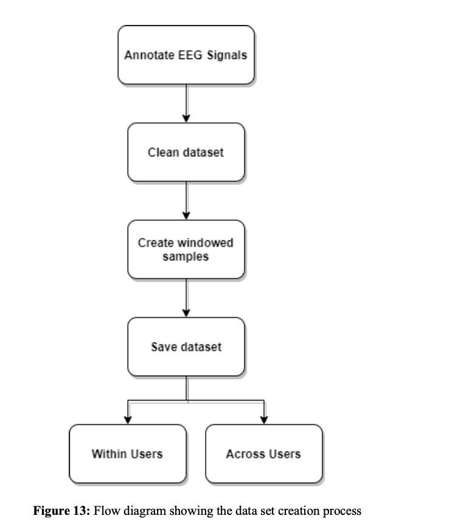

# Deep learning model for EEG-based attention detection

Full report can be found [here](Dissertation_Final.pdf)

## Abstract

Attention is at the core of neurological/cognitive functions, and deficits in attention have been linked to Alzheimer's disease (AD), Attention deficit hyperactivity disorder (ADHD), Traumatic Brain Injuries (TBI) and Posttraumatic Stress Disorder (PTSD). ADD can have severe consequences on a student's learning efficacy if it goes untreated. Traditionally, detecting inattentiveness is commonly done by observing an individual's expressions. However, this method is often inaccurate and increases the burden on teachers.

Interestingly, the detection of human attention levels can be automated with the use of deep learning (DL). Electroencephalography (EEG) signals provide a great source of information relating to human attention that can be analysed by deep learning algorithms. 

As a result, this study developed a novel deep learning architecture for EEG-based attention detection that builds upon the current state-of-the-art. The model predicted scores for attention, interest and effort on EEG data set of 18 users. Intra- and inter-subject classification results were evaluated using five-fold cross-validation. Results showed that the proposed model outperformed
other deep learning and baseline models, where it was able to achieve an accuracy of 93% on a single user with binary classification

## EEG Dataset and Experimental Design

### Overview

For EEG-based attention, interest and effort classification, this study used the [Instrumented Digital and Paper Reading dataset](https://risweb.st-andrews.ac.uk/portal/en/datasets/instrumented-digital-and-paper-reading-dataset(80f522b6-6d23-4751-9023-21a1e3d0eb5a).html). The dataset’s researchers gave 25 participants 16 readings with five paragraphs each and recorded their EEG signals while they were reading. The researchers used Neurolectrics2 Enobio 8, an eight-channel, wireless EEG helmet with a sampling frequency of 500hz (Figure 5). They created their helmet using the International 10-20 scalp electrode placement system. Throughout the experiment, they calibrated the EEG signals for three two-minute pauses.

 

### Experimental Design
The experiment took place in a room with two desks and two main stations- the experimenter3 and the participant stations.


During the experiments, the experimenter asked participants to read a series of one-page documents written in English in a way consistent with how they would read texts for academic purposes; i.e.,reading for comprehension. Participants had to signal to the experimenter when they had finished reading the document. At that point, they walked to a nearby table to finish a questionnaire, in which they scored each paragraph of the document they had just read in terms of how interesting they found the paragraph (Interest), how much attention they were paying to it (Attention), and how hard the paragraph was to read (Effort).

### Dataset

The original dataset had 424 raw EEG data files that were generated from 25 participants. However, after cleaning the dataset, there were 18 users left with a total of 277 reading sessions.



The EEG CSV files had ten columns: columns 1 – 8 represented the EEG signals from the eight channels while columns 9 & 10 were the timestamps and the adjusted UNIX timestamp in seconds. Each session had an associated JSON file that contained the start and end timestamps for each of the five paragraphs, along with their scores for attention, effort and interest.

To create the dataset (Figure 13), this study annotated each of the EEG CSV files using an associated JSON file that included the timestamps for different attention, interest and effort scores. Next, the dataset was cleaned by removing files with following criteria:



## Data Pre-processing

The primary purpose of this study was to reduce the number of steps needed for EEG processing; hence the processing stage was kept to a minimum. However, based on the current literature [76], EEG processing steps such as bandpass filtering, window sampling and feature scaling were still necessary for effective DL- based analysis.


 
## CNN-RNN Model Architecture

CNN-RNN (Hybrid model) was a composition of EEGNet and an LSTM RNN. The reasons why this study chose EEGNet were two-fold. Firstly, ShallowNet and DeepNet were both obtained from the Braindecode library, and they did not have direct compatibility with an RNN. Secondly, EEGNet outperformed ShallowNet and DeepNet in terms of classification results; therefore, it made sense to move forward with the top-performing CNN. Moreover, this project chose the LSTM RNN, mainly due to the temporal nature of EEG signals. Indeed, RNNs have the capacity for end-to-end temporal feature learning and classification; hence this study aimed to take advantage of this trait.

This study designed an RNN model with four layers: one input layer, one recurrent layer, an output layer and a softmax classification layer. The input size of the RNN was 56, and this was based on the input size of the final linear layer of the CNN. The hidden layer had sixteen hidden neurons and to prevent overfitting, this study determined the number of hidden neurons with this formula:


Based on the formula, the 𝛼 can be used to decide the degree of generalisation. As mentioned in “Neural Network design” [90], limiting the number of free parameters in the model to a small portion of degrees of freedom in the data can prevent overfitting. The degrees of freedom in the data is: 𝑵𝒔 ∗ (𝑵𝒊 + 𝑵𝟎), thus changing 𝛼 can prevent overfitting.

After designing the RNN, this study combined it with the EEGNet, by removing the fully connected layer of EEGNet, so that the learned features could be passed into the RNN. Once the features have been passed to the RNN, the RNN trains on the learned to features before classifying using the softmax activation function.


## Results

This study found that the hybrid model was the top-performing model overall with a binary classification accuracy of 73% and multi-class classification of 38%, across and within users. The hybrid model showed a dominant performance within users for binary classification, where it had the highest accuracy for 16 out of 18 users. Notably, the hybrid model had accuracies > 90% for users 11 and 15. EEGNet also had a good performance, beating the baseline accuracy across users for binary (58.79% vs 66%) and multi-class (25% vs 27%). EEGNet also had the joint highest binary classification across users and had the highest multi- class classification for 6 out of 18 users. DeepNet and ShallowNet performed a lot worse than the other models, where DeepNet had the highest accuracy for one user on the binary classification while ShallowNet had no case of highest accuracies.


## Conclusions

### Achievements

The primary objective of this project was to design a deep learning architecture for classifying EEG into scores of attention, interest and effort. To achieve this objective, this project designed a CNN architecture inspired by the Tensorflow implementation of EEGNet. This study then went on to achieve the second primary objective by evaluating the classification results of EEGNet against existing EEG-specific CNN architectures such as ShallowNet and DeepNet using 5-fold cross-validation. Importantly, the secondary objective of the project was to design a variant deep learning architecture to improve the classification results. Indeed this project designed a hybrid deep learning model comprised of EEGNet and an RNN which outperformed the classification results of the other CNN architectures. Most notably, the hybrid model obtained an accuracy of 93% on user 11 with binary classification.
This study also went beyond the primary and secondary objectives to improve the classification results. This study converted the problem from multi-class to binary classification which led to a 30% increase in accuracy. Moreover, data augmentation provided a slight improvement in accuracy for within user analysis.

### Concluding Remarks

This study designed a novel hybrid deep learning architecture for classifying EEG signals into scores for attention, interest and effort. Besides achieving all the objectives laid out, this study also provided a proof of concept for EEG-based attention detection. This proof of concept can be built upon by future research to develop brain-computer interface (BCI) applications for detecting attention.
Finally, the learning outcomes for me from this project were highly rewarding, as this project required me to research extensively on EEG, attention and deep learning. The practical element of working with Python and PyTorch to build a deep learning project was also worthwhile, as this experience can be applied to many other domains.

## Usage

1. Clone this repository: 
```
git clone https://github.com/Khalizo/Deep-Learning-Detection-Of-EEG-Based-Attention.git
```

2. Create a new virtual environment and install the Python libraries used in the code by running the following command:
   
```
pip install -r requirements.txt
```

3. Download the dataset via the one drive link from here: https://risweb.st-andrews.ac.uk/portal/en/datasets/instrumented-digital-and-paper-reading-dataset(80f522b6-6d23-4751-9023-21a1e3d0eb5a).html

4. Unzip and move the dataset to src
   
5. Run:
Here is how to run each of the models:
NB: ShallowNet and DeepNet take long to run so if you want to see quick results, best to run
EEGNet_Hybrid or baseline
ShallowNet and DeepNet:
- Simply run the notebook "Shallow Deep", and it will run 5 fold cross-validation for both models across users with binary classification
- To change the settings, right at the bottom you can change to "within users" by changing "cross user" to "per user" or change from binary to "multi" for multi-class classification
EEGNET_Hybrid
- Run EEGNet_Hybrid notebook The Default parameters are set to: Hybrid model running binary classification cross users
Baselines
- Run the baseline notebook, and it will run five-fold CV on all the models
Results
- Results are dumped in the results folder


